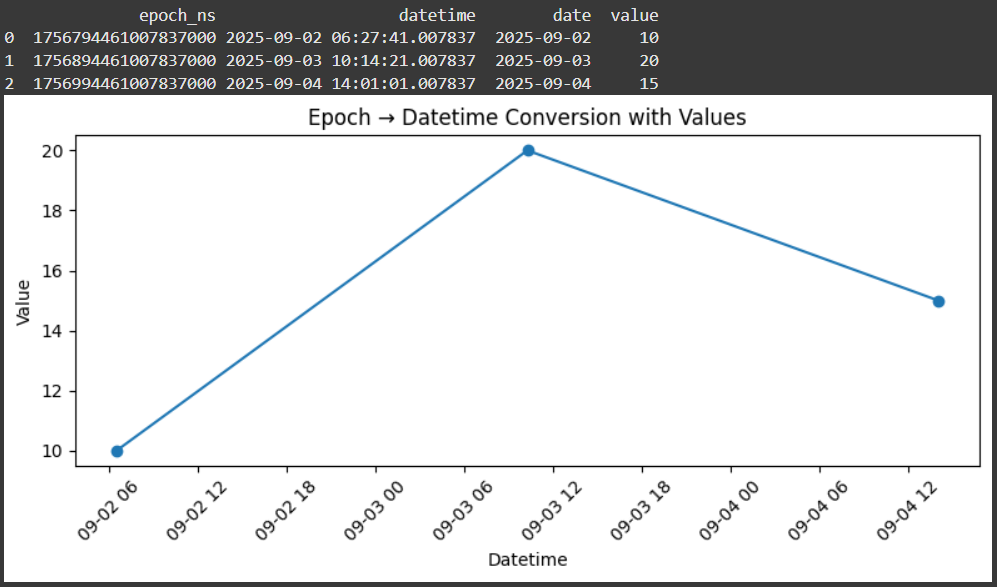
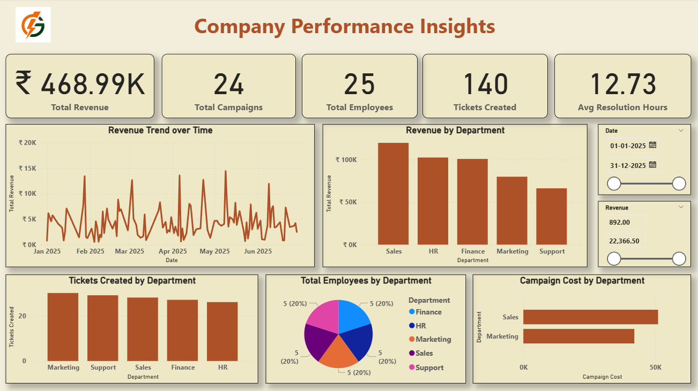

# 📊 Data Analyst Assignment – Kazam EV Tech

## 🔹 Introduction
This repository contains my submission for the Data Analyst Assignment at Kazam EV Tech.
The project demonstrates skills in Python (data wrangling & visualization), Google Sheets (formulas & automation), and Power BI (data modeling, DAX & dashboarding).  

---

## 🔹 Tools Used
- **Python (Google Colab, Pandas, Matplotlib)** → Epoch to Datetime & date conversion & visualization  
- **Google Sheets** → Multi-sheet data aggregation using formulas  
- **Power BI** → Interactive dashboard creation with slicers, charts, KPIs, and DAX measures
- **Github** → Version control and submission

---

## 🔹 Steps Performed  

### **Task 1 – Python (Epoch Conversion & Visualization)**
- Converted given **epoch timestamps (ns)** to **datetime** and **date** using Pandas.  
- Created a DataFrame with values mapped to dates.  
- Plotted a **time series chart** to visualize conversion results.  

**Code Snippet:**  
```python
pd.to_datetime(epoch_ns, unit="ns")
```  
**Google Colab Link:** [View Here](https://colab.research.google.com/drive/1JXl9N9GrlE6fNyYUshEuMI0JPoVUGqy-?usp=sharing)

**Screenshot:** 




---

### **Task 2 – Google Sheets (Formula Application)**
- Combined values from multiple sheets into a single sheet.  
- Used **ARRAYFORMULA** to merge columns dynamically.  

**Formula Used:**  
```excel
=ARRAYFORMULA({Sheet4!A1:B4, Sheet3!B1:B4, Sheet2!B1:B4})
```  

**Google Sheets Link:** [View Here](https://docs.google.com/spreadsheets/d/12RmKh_H1jKdIB0osLjs5FwUGTE0udutI3JEHR6Nz4lg/edit?usp=sharing)


---

### **Task 3 – Power BI Dashboard**
- Imported datasets: **Campaigns, Employees, Tickets, Transactions**.  
- Performed data cleaning, transformations, and relationship building.  
- Created measures and calculated columns using **DAX**.  
- Built an interactive dashboard including:  
  - KPIs: Total Revenue, Campaigns, Employees, Tickets, Avg Resolution Time  
  - Revenue Trend over Time  
  - Revenue by Department  
  - Tickets by Department  
  - Employees Distribution  
  - Campaign Cost by Department  
  - Slicers for **Date Range** & **Revenue Range**  

**Screenshot:** 



---

## 🔹 Assumptions
- Epoch timestamps were provided in **nanoseconds (ns)**.  
- For visualization, sample values were assumed against the converted dates.  
- Revenue and cost values are **aggregated per department**.  
- All employees were distributed equally across 5 departments in sample data.  

---

## 🔹 Deliverables
1. **Python Code File** (`.ipynb`) – Epoch conversion & visualization  
2. **Google Sheets Formula** – Data aggregation formula  
3. **Power BI Dashboard File** (`.pbix`) – Final interactive dashboard  
4. **README.md** – Project documentation and assumptions 

---

